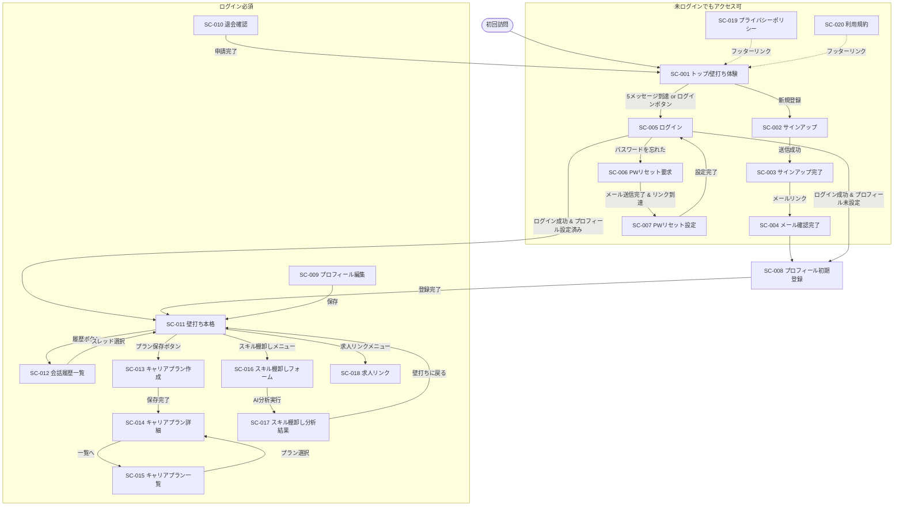

# 画面設計書

| 項目 | 内容 |
|---|---|
| プロジェクト名 | engineer-career-ai |
| バージョン | 1.0 |
| 作成日 | 2026-05-02 |

---

## 1. 画面一覧

| 画面ID | 画面名 | 画面種別 | 概要 | 関連機能ID |
|---|---|---|---|---|
| SC-001 | トップ(壁打ち体験) | 入力+表示 | 未ログインで壁打ちを体験できるランディング兼チャット画面 | F-007, F-009, F-010, F-011, F-012, F-013, F-033 |
| SC-002 | サインアップ | 入力 | メール+PW or ソーシャルで新規登録。13歳未満チェック含む | F-001, F-002, F-003, F-041 |
| SC-003 | サインアップ完了 | 完了 | 確認メール送信済み通知 | F-001 |
| SC-004 | メール確認完了 | 完了 | メールリンクからの到達、確認成功を表示 | F-001-2 |
| SC-005 | ログイン | 入力 | メール+PW or ソーシャルでログイン | F-001-3, F-002, F-003 |
| SC-006 | パスワードリセット要求 | 入力 | メールアドレス入力→リセットメール送信 | F-001-4 |
| SC-007 | パスワードリセット設定 | 入力 | 新パスワード入力(メールリンクから到達) | F-001-4 |
| SC-008 | プロフィール初期登録 | 入力 | 初回ログイン後のプロフィール入力ウィザード | F-004, F-041 |
| SC-009 | プロフィール編集 | 編集 | 登録情報の確認・変更 | F-005 |
| SC-010 | 退会確認 | 確認 | 退会申請の確認。30日後完全削除の説明 | F-006 |
| SC-011 | 壁打ち(ログイン後) | 入力+表示 | 履歴・プロフィール連動の本格チャット | F-008, F-009, F-010, F-011, F-012, F-013, F-034 |
| SC-012 | 会話履歴一覧 | 一覧 | 過去スレッドのリスト。再開・削除 | F-015, F-016, F-017 |
| SC-013 | キャリアプラン作成 | 入力 | AI対話結果を構造化して保存 | F-018 |
| SC-014 | キャリアプラン詳細・編集 | 詳細+編集 | プラン内容の表示・手動編集 | F-019 |
| SC-015 | キャリアプラン一覧 | 一覧 | 保存済みプランのリスト | F-020 |
| SC-016 | スキル棚卸しフォーム | 入力 | テンプレートに沿ったスキル・経験入力 | F-021 |
| SC-017 | スキル棚卸しAI分析結果 | 表示 | フォーム結果のAI要約・提案 | F-022 |
| SC-018 | 求人リンク | 表示 | 外部求人サイトへのリンク集 | F-026 |
| SC-019 | プライバシーポリシー | 表示 | 法的テキスト | F-037 |
| SC-020 | 利用規約 | 表示 | 法的テキスト・免責事項 | F-038 |

画面種別: 入力 / 一覧 / 詳細 / 編集 / 確認 / 完了 / 表示

---

## 2. 画面遷移図



---

## 3. 共通コンポーネント

| コンポーネントID | 名称 | 概要 | 表示対象 |
|---|---|---|---|
| CMP-001 | ヘッダー | ロゴ、ナビ(履歴/プラン/スキル/求人)、プロフィールメニュー | ログイン後 |
| CMP-002 | ゲストヘッダー | ロゴ、ログインボタン、新規登録ボタン | 未ログイン |
| CMP-003 | フッター | プライバシーポリシー、利用規約、コピーライト | 全画面 |
| CMP-004 | AI免責バナー | 「AIの回答は参考情報です。最終判断はご自身で」の常設表示 | チャット画面全般(F-012) |
| CMP-005 | Cookie同意バナー | 初回訪問時に表示(F-040) | 全画面(初回のみ) |
| CMP-006 | ログイン誘導モーダル | 5メッセージ到達時に表示。「続けるにはログインが必要」 | SC-001 |
| CMP-007 | 専門家紹介カード | 重要相談時に表示(F-013) | SC-001, SC-011 |
| CMP-008 | レート制限通知 | 1日上限到達時のインラインメッセージ | SC-011 |
| CMP-009 | トースト通知 | 成功/エラーメッセージ(3秒自動消去) | 全画面 |

---

## 4. 画面別レイアウト

### SC-001 トップ(壁打ち体験)

#### レイアウト(ワイヤーフレーム)

```
+------------------------------------------+
| [ロゴ]              [ログイン] [新規登録] |  ← CMP-002
+------------------------------------------+
|                                          |
|  AIとキャリアを壁打きしよう              |
|  エンジニア特化・利害なし・手軽に相談    |
|                                          |
|  テーマ: [転職▼] [スキルアップ▼]        |  ← F-010
|         [マネジメント転向▼] [その他▼]  |
|                                          |
|  +------------------------------------+  |
|  | AI: こんにちは！どんなキャリアの   |  |
|  |     相談でも気軽にどうぞ。         |  |
|  +------------------------------------+  |
|  | あなた: ○○○○                      |  |
|  +------------------------------------+  |
|  |             [提案ボタン例]         |  |  ← F-009 ハイブリッドUI
|  +------------------------------------+  |
|                                          |
|  [                  メッセージを入力  ]  |
|  [                              送信 ▶] |
|                                          |
|  ※ AIの回答は参考情報です(5/5)         |  ← CMP-004 + カウンタ
+------------------------------------------+
| PP | 利用規約 | © engineer-career-ai     |  ← CMP-003
+------------------------------------------+
```

#### 画面項目

| No | 項目名 | 種別 | 必須 | 備考 |
|:--:|---|---|:--:|---|
| 1 | テーマ選択 | ボタン群 | - | 選択するとシステムプロンプトが変わる |
| 2 | チャット表示エリア | 表示 | - | AIと自分の会話をバブル形式で表示 |
| 3 | 提案ボタン | ボタン | - | AI応答後に表示(ハイブリッドUI) |
| 4 | メッセージ入力 | テキストエリア | ○ | 最大4,000文字、Enter送信(Shift+Enterで改行) |
| 5 | 送信ボタン | ボタン | - | AI応答ストリーミング中は無効化 |
| 6 | メッセージカウンタ | 表示 | - | 「X/5」で残り回数を表示 |
| 7 | ログイン誘導モーダル | モーダル | - | 5件目送信後に表示(CMP-006) |

#### イベント

| トリガー | 処理内容 | 遷移先 |
|---|---|---|
| 送信ボタン / Enter | API-013 呼び出し、ストリーミング表示 | 同画面 |
| 5メッセージ到達 | CMP-006(ログイン誘導モーダル)表示 | モーダル内で SC-005 or SC-002 |
| テーマ選択 | API-015 でセッションのテーマ更新 | 同画面 |
| ログインボタン | — | SC-005 |
| 新規登録ボタン | — | SC-002 |

---

### SC-002 サインアップ

#### レイアウト

```
+------------------------------------------+
| [ロゴ]                                   |
+------------------------------------------+
|                                          |
|         新規アカウント作成               |
|                                          |
|  [G] Google で登録                       |
|  [GitHub] GitHub で登録                  |
|  ──── または ────                        |
|  メールアドレス: [                    ]  |
|  パスワード:     [                    ]  |
|  (12文字以上、英大小数字記号3種以上)     |
|                                          |
|  生年月日: [年▼] [月▼] [日▼]          |  ← F-041
|  □ 18歳未満の方は保護者の同意が必要です |
|                                          |
|  □ 利用規約・プライバシーポリシーに同意  |
|                                          |
|  [      アカウントを作成する      ]      |
|                                          |
|  すでにアカウントをお持ちの方 → ログイン |
+------------------------------------------+
```

#### 画面項目

| No | 項目名 | 種別 | 必須 | チェック | 備考 |
|:--:|---|---|:--:|---|---|
| 1 | Google 登録ボタン | ボタン | - | - | API-007 |
| 2 | GitHub 登録ボタン | ボタン | - | - | API-008 |
| 3 | メールアドレス | テキスト | ○ | RFC 5322形式、最大254文字 | |
| 4 | パスワード | パスワード | ○ | 12〜128文字、3種以上 | |
| 5 | 生年月日(年) | セレクト | ○ | 西暦。13歳未満は登録不可 | F-041 |
| 6 | 生年月日(月) | セレクト | ○ | 1〜12 | |
| 7 | 生年月日(日) | セレクト | ○ | 1〜31 | |
| 8 | 18歳未満同意 | チェック | △ | 18歳未満の場合のみ必須 | |
| 9 | 利規・PP同意 | チェック | ○ | 未チェックで送信不可 | |
| 10 | 登録ボタン | ボタン | - | reCAPTCHA v3 検証後 | F-035 |

#### イベント

| トリガー | 処理内容 | 遷移先 |
|---|---|---|
| 登録ボタン | バリデーション → API-001 → 確認メール送信 | 成功: SC-003 / 失敗: エラー表示 |
| 13歳未満が入力された場合 | 「ご利用いただけません」エラー表示 | 同画面 |

---

### SC-005 ログイン

#### レイアウト

```
+------------------------------------------+
| [ロゴ]                                   |
+------------------------------------------+
|                                          |
|           ログイン                       |
|                                          |
|  [G] Google でログイン                   |
|  [GitHub] GitHub でログイン              |
|  ──── または ────                        |
|  メールアドレス: [                    ]  |
|  パスワード:     [                    ]  |
|                                          |
|  [          ログイン          ]          |
|                                          |
|  パスワードをお忘れの方                  |
|  アカウントをお持ちでない方 → 新規登録   |
+------------------------------------------+
```

#### イベント

| トリガー | 処理内容 | 遷移先 |
|---|---|---|
| ログインボタン | API-003 | 成功&初回: SC-008 / 成功&既存: SC-011 / 失敗: エラー |
| パスワードを忘れた | — | SC-006 |

---

### SC-008 プロフィール初期登録

#### レイアウト(ウィザード形式、ステップ2/3)

```
+------------------------------------------+
| ステップ 2 / 3  キャリア情報             |
| ●●○                                      |
+------------------------------------------+
|  ハンドルネーム: [                    ]  |  必須
|  現職・肩書き:   [                    ]  |  任意
|  経歴(自由記述): [                    ]  |  任意
|  現在の年収:     [          ] 万円       |  任意
|  目標年収:       [          ] 万円       |  任意
|                                          |
|  得意スキル(複数可):                    |  必須
|  [JavaScript] [React] [+追加]            |
|                                          |
|  志向性:                                 |  必須
|  ○ 技術スペシャリスト志向               |
|  ○ マネジメント志向                     |
|  ○ まだ決まっていない                   |
|                                          |
|  [戻る]          [次へ →]               |
+------------------------------------------+
```

---

### SC-011 壁打ち(ログイン後)

#### レイアウト

```
+------------------------------------------+
| [ロゴ] 履歴 プラン スキル 求人 [👤ietsuka▼]| ← CMP-001
+------------------------------------------+
|                  |                       |
| 会話履歴         | テーマ:[転職▼]        |
| ─────────────── |                       |
| ▶ 転職について  | AI: おはようございます |
| ▶ スキルアップ  |     ietsuka さん。前回  |
|   2026-04-28   |     の続きですね。      |
|                  |                       |
| [新しい壁打ち]  | あなた: ○○○○          |
|                  |                       |
|                  | [提案: 強みを整理する] |  ← F-009
|                  | [提案: 求人を見る]    |
|                  |                       |
|                  | [         入力      ] |
|                  | [              送信▶] |
|                  |                       |
|                  | ※AIは参考情報(F-012)|
+------------------------------------------+
|  PP | 利用規約              (残り 22/30) |  ← CMP-008
+------------------------------------------+
```

#### 画面項目

| No | 項目名 | 種別 | 必須 | 備考 |
|:--:|---|---|:--:|---|
| 1 | サイドバー(履歴一覧) | 一覧 | - | クリックで過去スレッドに切替 |
| 2 | 新しい壁打きボタン | ボタン | - | 新規セッション開始 |
| 3 | テーマ選択 | セレクト | - | 変更可(API-015) |
| 4 | チャット表示エリア | 表示 | - | AI/ユーザーのバブル、ストリーミング |
| 5 | 提案ボタン群 | ボタン | - | AI応答後に表示(ハイブリッドUI) |
| 6 | メッセージ入力 | テキストエリア | ○ | 最大4,000文字 |
| 7 | 送信ボタン | ボタン | - | ストリーミング中は無効化 |
| 8 | 残り回数表示 | 表示 | - | 「残り XX/30」 |
| 9 | キャリアプラン保存ボタン | ボタン | - | 会話からプランを作成(F-018) |

#### イベント

| トリガー | 処理内容 | 遷移先 |
|---|---|---|
| 送信 | API-014(ストリーミング、履歴自動保存) | 同画面 |
| 提案ボタン | そのテキストをメッセージとして送信 | 同画面 |
| 上限到達 | CMP-008 でレート制限通知 | 同画面(入力無効化) |
| キャリアプラン保存 | — | SC-013 |
| 専門家紹介カード表示 | AI が重要相談を検知時に自動表示 | 同画面 |

---

### SC-012 会話履歴一覧

#### レイアウト

```
+------------------------------------------+
| [ヘッダー CMP-001]                       |
+------------------------------------------+
|  会話履歴                   [一括削除]   |
|                                          |
|  ┌────────────────────────────────────┐  |
|  │ □ 転職について          2026-04-28 │  |
|  │   「スタートアップへの転職を…」    │  |
|  │                    [再開] [削除]   │  |
|  ├────────────────────────────────────┤  |
|  │ □ スキルアップ計画      2026-04-25 │  |
|  │   「Rustを学ぶべきか悩んでいて…」  │  |
|  │                    [再開] [削除]   │  |
|  └────────────────────────────────────┘  |
+------------------------------------------+
```

#### イベント

| トリガー | 処理内容 | 遷移先 |
|---|---|---|
| 再開ボタン | API-017 でセッションをロード | SC-011 |
| 削除ボタン | 確認トースト → API-018 | 同画面 |
| 一括削除 | 選択チェックを確認 → API-018 | 同画面 |

---

### SC-016 スキル棚卸しフォーム

#### レイアウト

```
+------------------------------------------+
| [ヘッダー CMP-001]                       |
+------------------------------------------+
|  スキル棚卸し                            |
|                                          |
|  ① 経験したこと(技術・業務)             |
|  [                                    ]  |
|                                          |
|  ② 強みだと思うこと                     |
|  [                                    ]  |
|                                          |
|  ③ 弱み・苦手なこと                     |
|  [                                    ]  |
|                                          |
|  ④ 興味・やってみたいこと               |
|  [                                    ]  |
|                                          |
|  ⑤ 働き方の希望                         |
|  [                                    ]  |
|                                          |
|  [    AIに分析してもらう ▶    ]          |
+------------------------------------------+
```

#### イベント

| トリガー | 処理内容 | 遷移先 |
|---|---|---|
| AI分析ボタン | API-023 で保存 → API-024 でAI分析 | SC-017 |

---

## 5. 共通ルール

### 5.1 レスポンシブ対応

| ブレークポイント | 対応方針 |
|---|---|
| ～ 767px(スマホ) | SC-011 のサイドバーはハンバーガーメニューに格納 |
| 768px ～ 1023px(タブレット) | サイドバーは折りたたみ可 |
| 1024px ～(PC) | サイドバー常時表示 |

### 5.2 入力チェック共通ルール

- 必須項目: 未入力で送信時に「○○を入力してください」をフィールド下に表示(赤)
- 文字数超過: 入力中にリアルタイムでカウント表示、超過時は赤文字
- 形式不正: フォーカスアウト時にチェック

### 5.3 メッセージ規約

| 種別 | 表示方法 | 自動消去 |
|---|---|:--:|
| 成功 | 緑色トースト(CMP-009) | 3秒後 |
| エラー | 赤色インライン or トースト | ユーザー操作で消去 |
| 確認 | モーダルダイアログ | — |
| 警告 | 黄色インラインバナー | — |

### 5.4 AI応答のローディング表示

- ストリーミング開始まで: 「...」アニメーション(ドットが点滅)
- ストリーミング中: テキストが逐次表示。送信ボタン無効化
- エラー時: 「応答の取得に失敗しました。もう一度お試しください」+ 再送信ボタン

### 5.5 アクセシビリティ

- フォーム要素に `aria-label` を必須付与
- キーボード操作: Enter で送信、Tab でフォーカス移動
- チャット更新は `aria-live="polite"` で通知
- 色だけに頼った情報伝達は禁止(アイコン or テキストを併用)

### 5.6 セキュリティ(画面レベル)

- ログイン必須画面は未認証時に SC-005 へリダイレクト(middleware で制御)
- パスワード入力欄は `autocomplete="new-password"` or `"current-password"` を設定
- 年収等の機微情報は他人画面には表示しない(MVP では他人の画面は存在しないが設計に明記)
