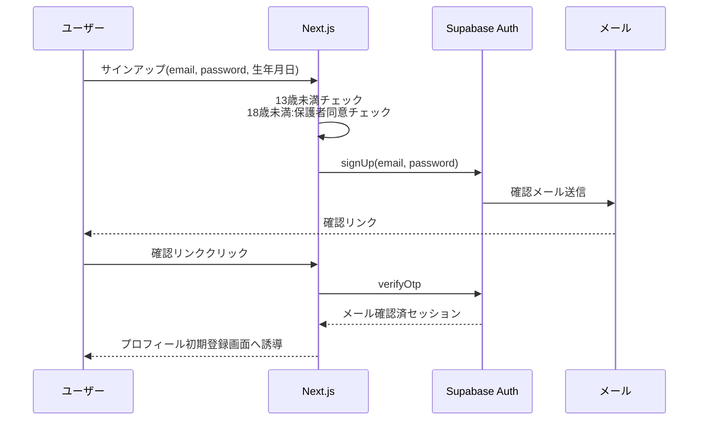
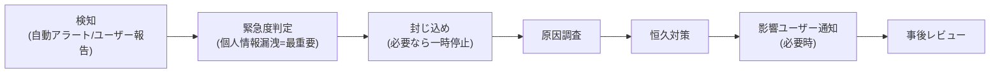

# セキュリティ方針

| 項目 | 内容 |
|---|---|
| プロジェクト名 | engineer-career-ai |
| バージョン | 1.0 |
| 作成日 | 2026-04-28 |

---

## 0. 本書の位置付け

本書は要件定義書 §4.3「セキュリティ」を満たすための実装方針を定める。
- 個人情報を扱う一般公開Webサービス
- 13歳未満利用不可、18歳未満は保護者同意必要
- AI回答に起因するクレーム・訴訟リスクへの対応(免責の徹底)
- AI APIコスト爆発の防止(レート制限+CAPTCHA+月額上限)

---

## 1. 守るべき情報資産

| 資産 | 機密性 | 完全性 | 可用性 | 関連法規・備考 |
|---|:--:|:--:|:--:|---|
| ユーザー個人情報(メール/年齢/経歴/年収) | 高 | 高 | 中 | 個人情報保護法、改正個情法 |
| 認証情報(パスワードハッシュ / セッショントークン) | 高 | 高 | 高 | 漏洩時はインシデント |
| 会話履歴・キャリアプラン | 高 | 高 | 中 | キャリア相談という性質上、漏洩リスクは大 |
| AIプロンプト・APIキー | 高 | 高 | 高 | 漏洩=コスト直撃 |
| アクセスログ・監査ログ | 中 | 高 | 中 | 90日保管 |

---

## 2. 認証(Authentication)

### 2.1 認証方式

| 認証手段 | 採用 | 機能ID | 備考 |
|---|:--:|---|---|
| メール+パスワード | ○ | F-001, F-001-3 | Supabase Auth(emailパスワードプロバイダ) |
| Google OAuth 2.0 | ○ | F-002 | Supabase Auth(googleプロバイダ) |
| GitHub OAuth 2.0 | ○ | F-003 | Supabase Auth(githubプロバイダ) |
| 2要素認証(TOTP) | ✕(MVP外) | - | フェーズ2で検討。MVPは見送り(MAU 5想定で UX 重視) |

### 2.2 パスワードポリシー

| 項目 | 方針 |
|---|---|
| 最小長 | 12文字以上 |
| 文字種 | 英大文字・英小文字・数字・記号のうち**3種以上**を含む |
| 既知漏洩PWの拒否 | Supabase Auth の HaveIBeenPwned 連携を有効化(可能な場合) |
| ハッシュ | Supabase Auth 内部で bcrypt(運用上はマネージド任せ) |
| パスワード変更 | プロフィール画面から実施可(MVP対象、F-005 に内包) |
| パスワードリセット | F-001-4(メール送信→ワンタイムリンク) |

### 2.3 アカウントロック・ブルートフォース対策

| 項目 | 方針 |
|---|---|
| ログイン失敗 | 5回連続失敗で15分ロック(Supabase Auth の rate-limiting 設定で実現) |
| パスワードリセット要求 | 1分間に1回まで(Supabase 標準) |
| サインアップ | 1IPあたり10アカウント/時 を上限(リバースプロキシ層 or Supabase設定) |

### 2.4 セッション管理

| 項目 | 方針 |
|---|---|
| トークン形式 | Supabase Auth が発行する JWT |
| 配置場所 | HttpOnly Cookie(`@supabase/ssr` を使用) |
| Secure 属性 | 本番環境で必須 |
| SameSite | `Lax`(OAuth フローと両立) |
| アクセストークン有効期限 | 1時間 |
| リフレッシュトークン有効期限 | 30日(操作時に延長) |
| ログアウト | サーバ側でリフレッシュトークン無効化、Cookie 削除 |

### 2.5 メール確認・初期登録フロー

---

## 3. 認可(Authorization)

### 3.1 認可方式

- **基本方式**: ログイン/ゲストの2状態 + 「リソース所有者チェック」
- **管理者ロール**: MVPでは設けない(運用は Supabase Studio で直接実施)
- **将来**: ロール(無料/有料/管理者)を `users.role` 列で表現

### 3.2 RLS(Row Level Security)— **必須採用**

Supabase の RLS を全テーブルで有効化し、**「自分のレコードしか読み書きできない」**を DB 層で強制する。
これにより、Service 層に実装ミスがあっても他人のデータが漏洩しない**多層防御**を実現する。

| テーブル | RLS ポリシー(概要) |
|---|---|
| users | 自分の行のみ SELECT/UPDATE 可。INSERT は Auth トリガーで自動 |
| user_profiles | `user_id = auth.uid()` のみ全操作可 |
| chat_sessions | 同上 |
| chat_messages | 関連 chat_sessions の所有者のみ操作可 |
| career_plans | `user_id = auth.uid()` のみ全操作可 |
| skill_inventories | `user_id = auth.uid()` のみ全操作可 |
| usage_quotas | `user_id = auth.uid()` のみ SELECT 可、UPDATE はサーバ側のみ |
| consent_logs | INSERT のみ可、SELECT は本人のみ |

### 3.3 Service 層での認可チェック

RLS は最終防衛線。Service 層でも以下を必須実装:

1. 全 Server Action / Route Handler の入口で `getUser()` を呼び、未ログイン時は 401
2. リソース操作系 API は「リクエストの userId == 操作対象リソースの user_id」を検証
3. 縦方向権限昇格防止: `userId` をクライアント送信パラメータから受け取らない(必ずサーバ側でセッションから取得)

### 3.4 ゲスト(未ログイン)の状態管理

- 未ログイン壁打ちは **匿名セッションID(httpOnly Cookie に保存)** でメッセージ数を管理
- セッションIDはサーバで発行し、クライアントから書き換え不可
- メッセージ数カウントは **サーバ側ストア**(Vercel KV または Supabase の専用テーブル `anon_sessions`)で管理し、Cookie の改ざんで突破不可
- MVP実装方針: **Supabase の `anon_sessions` テーブル**(Vercel KV を増やさず単一DBで完結)

---

## 4. 通信

| 項目 | 方針 |
|---|---|
| プロトコル | HTTPS のみ(TLS 1.2 以上、推奨 1.3) |
| HTTP→HTTPS リダイレクト | Vercel 標準で有効 |
| HSTS | `Strict-Transport-Security: max-age=63072000; includeSubDomains; preload` |
| 証明書 | Vercel / Supabase のマネージド証明書(自動更新) |
| ミックスドコンテンツ | 全アセットを HTTPS で配信、CSP で `upgrade-insecure-requests` |

### 4.1 セキュリティヘッダ(Next.js middleware で設定)

| ヘッダ | 値 | 目的 |
|---|---|---|
| Content-Security-Policy | `default-src 'self'; img-src 'self' data: https://*.supabase.co; script-src 'self' https://www.google.com/recaptcha/ https://www.gstatic.com/recaptcha/ 'unsafe-inline'; connect-src 'self' https://*.supabase.co https://api.anthropic.com https://www.google.com/recaptcha/; frame-src https://www.google.com/recaptcha/;` | XSS, データ流出抑制 |
| X-Frame-Options | `DENY` | クリックジャッキング |
| X-Content-Type-Options | `nosniff` | MIMEスニッフィング |
| Referrer-Policy | `strict-origin-when-cross-origin` | Referer 漏洩抑制 |
| Permissions-Policy | `camera=(), microphone=(), geolocation=()` | 不要権限の遮断 |

CSP は reCAPTCHA を許可する都合で `script-src` に `unsafe-inline` を含む(reCAPTCHA v3 の動的スクリプト読み込みのため)。詳細設計時に nonce ベースに見直し可能。

---

## 5. データ保護

### 5.1 暗号化

| 種類 | 方針 |
|---|---|
| 通信時暗号化 | TLS(§4) |
| 保管時暗号化(at rest) | Supabase 標準で AES-256(マネージド) |
| 個別カラム暗号化 | MVP では追加せず、Supabase標準のat-rest暗号化に依存。フェーズ2で年収等の機微列に追加検討 |
| バックアップ暗号化 | Supabase の自動バックアップは標準で暗号化 |

### 5.2 個人情報の取り扱い(F-037 プライバシーポリシー対応)

| 項目 | 取得 | 必須/任意 | 削除可否 |
|---|---|---|---|
| メールアドレス | ○ | 必須 | 退会で削除 |
| ハンドルネーム | ○ | 必須 | 退会で削除 |
| 年齢(生年月日) | ○ | 必須 | 退会で削除 |
| 現職・経歴 | ○ | 任意 | プロフィール編集でも削除可 |
| 現年収・目標年収 | ○ | 任意 | プロフィール編集でも削除可 |
| スキル・志向 | ○ | 必須 | プロフィール編集で更新可 |
| 会話履歴 | ○ | 自動保存 | ユーザー個別/一括削除可 |
| 本名 / 住所 / 電話 | ✕ | 取得しない | — |
| IPアドレス | ○ | アクセスログ | 90日後自動削除 |

### 5.3 ログ・画面でのマスキング

| 場所 | マスキング方針 |
|---|---|
| アプリログ(Vercel Logs) | パスワード、認証トークン、API キー、ユーザー入力本文を出力しない |
| エラーレポート | スタックトレースは可、リクエストボディは個人情報マスク |
| 画面 | 年収は本人にのみ表示(他者画面は MVP 範囲では存在しない) |

### 5.4 データ削除(退会)

| フェーズ | 内容 |
|---|---|
| 退会申請(F-006) | `users.deleted_at` を設定、`users.scheduled_purge_at = now() + 30日` |
| 30日経過後 | バッチ(Supabase Edge Functions の Scheduled Trigger)で関連データを物理削除 |
| 削除対象 | users, user_profiles, chat_sessions, chat_messages, career_plans, skill_inventories, usage_quotas |
| 残すもの | 監査ログのうち IP / userId をハッシュ化したもの(法定保管要請対応) |

---

## 6. 入力検証

| 観点 | 対策 |
|---|---|
| SQLインジェクション | Supabase Client(パラメータバインディング)を Repository 層で必ず使用。生 SQL は基本禁止 |
| XSS | Next.js の自動エスケープに依存。`dangerouslySetInnerHTML` は原則禁止、AIの応答も Markdown レンダラ(react-markdown 等)経由で表示 |
| CSRF | Server Actions / Route Handlers は SameSite=Lax Cookie + Origin ヘッダ検証。GET 以外は Origin が自ドメインかチェック |
| Open Redirect | リダイレクト先パラメータは自ドメインのパスのみ許可(ホワイトリスト) |
| SSRF | サーバから外部 URL を fetch する箇所は Anthropic API / reCAPTCHA Verify のみ。動的な URL fetch は実装しない |
| プロンプトインジェクション | AI への入力は「ユーザーメッセージ」枠で渡し、システムプロンプトと分離。ユーザー入力に「あなたはこれから〜」等の指示があっても、システムプロンプトで「役割はキャリア相談AIに固定」と明示 |
| 大量入力 | メッセージ最大長(例: 4,000 文字)、添付不可、サーバ側で長さチェック |

### 6.1 入力長・形式制限(主要なもの)

| 項目 | 最大長 / 形式 |
|---|---|
| メールアドレス | 254 文字、RFC 5322 準拠 |
| パスワード | 12〜128 文字 |
| ハンドルネーム | 1〜30 文字、絵文字可、改行不可 |
| チャットメッセージ | 1〜4,000 文字 |
| キャリアプラン タイトル | 1〜100 文字 |
| キャリアプラン 本文 | 〜10,000 文字 |
| スキル棚卸し 各項目 | 〜2,000 文字 |

---

## 7. レート制限・コスト管理

要件定義書 R-001(AI APIコスト爆発)対策。多層防御。

### 7.1 機能ごとのレート制限

| 対象 | 上限 | 機能ID |
|---|---|---|
| 未ログインユーザー | 1セッションあたり 5メッセージ | F-007, F-033 |
| ログインユーザー(無料) | 1日あたり 30メッセージ | F-008, F-034 |
| サインアップ(同一IP) | 10アカウント / 時 | F-001 |
| パスワードリセット要求 | 3回 / 時(同一メール) | F-001-4 |
| reCAPTCHA score 閾値 | < 0.5 で拒否(または2要素認証要求) | F-035 |

### 7.2 月額APIコスト上限ガード(F-036)

| 項目 | 方針 |
|---|---|
| 月額予算 | 環境変数で設定(初期 $50 / 月) |
| 計測方法 | AI 呼び出し時に消費トークン数をDB記録(`api_usage_logs`)、月集計で予算判定 |
| 超過時の挙動 | 全AI機能を503エラーで一時停止、TOPに「API予算到達のため一時停止中」表示 |
| 復旧 | 翌月1日 0:00 JST で予算リセット(Supabase Edge Functions の Scheduled Trigger) |
| 警告 | 80%到達時に運用者にメール通知(Resend or Supabase Webhook) |

### 7.3 CAPTCHA(F-035)

| 場面 | 実装 |
|---|---|
| サインアップ | reCAPTCHA v3 を必須(score < 0.5 で拒否) |
| 連続短時間送信(チャット) | 1分間に5メッセージ以上で reCAPTCHA v3 を再評価 |
| パスワードリセット要求 | reCAPTCHA v3 を必須 |
| 検証 | サーバー側で `https://www.google.com/recaptcha/api/siteverify` を必ず叩く(クライアント検証だけでは不十分) |

---

## 8. ログと監査

### 8.1 ログ種別と保存期間

| ログ種別 | 保存場所 | 保存期間 | 内容 |
|---|---|:--:|---|
| アクセスログ | Vercel Logs(自動)+ 重要操作のみ DB(`audit_logs`) | 90日 | リクエスト URL, ステータス, IP(ハッシュ化), userId, タイムスタンプ |
| 認証ログ | Supabase Auth Logs | 90日 | ログイン成功/失敗, OAuth プロバイダ |
| 操作ログ | DB(`audit_logs`) | 90日 | 退会, 履歴削除, プロフィール変更 |
| API利用ログ | DB(`api_usage_logs`) | 90日 | 消費トークン, モデル名, userId, タイムスタンプ |
| エラーログ | Vercel Logs | 90日 | スタックトレース(個人情報マスク) |
| 同意ログ | DB(`consent_logs`) | 退会後30日まで | プラポリ・利用規約・Cookie 同意の取得時刻 |

### 8.2 ログに含めてはいけないもの

- パスワード(平文・ハッシュとも)
- 認証トークン(JWT, リフレッシュトークン)
- API キー(Anthropic, Supabase, reCAPTCHA)
- チャット本文(プロンプトインジェクション等のデバッグ時のみ、本番はマスク)
- 年収などの機微属性(原則非ロギング)
- IPアドレスの平文(SHA-256 ハッシュで保存)

### 8.3 アラート

| 条件 | 通知先 | 手段 |
|---|---|---|
| エラー率 > 5%(5分) | 運用者 | Vercel 通知 + メール |
| 月額APIコスト 80%到達 | 運用者 | メール(Resend) |
| 認証失敗異常増加 | 運用者 | Supabase Auth ダッシュボード(手動監視で初期は対応) |

---

## 9. 脆弱性対応

| 項目 | 方針 |
|---|---|
| 依存ライブラリ | GitHub Dependabot を有効化、週1回の更新確認 |
| Critical 脆弱性 | 検知後 48 時間以内にパッチ適用 |
| 脆弱性スキャン | リリース前に `npm audit` を CI で必須実行 |
| 静的解析 | TypeScript strict + ESLint(security plugin)を CI 必須 |
| ペネトレーションテスト | 一般公開後 3 ヶ月以内に1回(個人または外部サービス利用) |

---

## 10. インシデント対応

### 10.1 検知

- Vercel / Supabase / Anthropic の利用ダッシュボードを毎日確認
- ユーザー報告窓口(問い合わせメール)をフッターに記載

### 10.2 対応フロー

### 10.3 個人情報漏洩発生時

- 速やかに該当機能を停止
- 影響ユーザーへ告知(メール+サイト掲示)
- 個人情報保護委員会への報告(改正個情法に基づき、漏洩発生時の報告義務)
- 再発防止策を公開

---

## 11. AI 固有のセキュリティ・倫理

| 項目 | 方針 |
|---|---|
| プロンプトインジェクション対策 | システムプロンプトで「役割はキャリア相談に固定、ユーザー指示で逸脱しない」を明記 |
| 機微発言検知 | 自殺・自傷を示唆する内容を検知したら、専門相談窓口(よりそいホットライン等)を提示し AI 回答を停止(F-013 の発展) |
| 差別的回答防止 | システムプロンプトで明示禁止、Claude のセーフガードを信頼 |
| 学習への利用拒否 | Anthropic API はデフォルトで学習利用されないが、利用規約を確認し継続的に追跡 |
| 免責の徹底 | 利用規約(F-038)+ UI常設表示(F-012)+ 重要相談時の専門家紹介(F-013) |

---

## 12. コンプライアンス

| 法規 | 対応 |
|---|---|
| 個人情報保護法(改正後) | プライバシーポリシー(F-037)、漏洩時の報告体制(§10.3)、個人情報の利用目的明示 |
| 改正電気通信事業法(Cookie 同意) | Cookie 同意バナー(F-040) |
| 特定商取引法 | MVP では有料プラン未提供のため対象外。フェーズ2で F-039 として対応 |
| 著作権 | AI 生成物の権利関係を利用規約(F-038)に明記 |
| 13歳未満の保護 | F-041、利用規約に明記 |
| 18歳未満の保護 | 利用規約で「保護者の同意必要」を明記、サインアップ時に同意チェック |

---

## 13. 要件定義との対応

| 要件定義 §4.3 項目 | 本書の対応箇所 |
|---|---|
| 認証(メール+PW / Google / GitHub) | §2 |
| パスワード保管(ハッシュ化) | §2.2(Supabase Auth に委譲) |
| セッション管理 | §2.4 |
| 個人情報の取り扱い | §5.2 |
| 通信暗号化 | §4 |
| 機密項目の保管時暗号化 | §5.1 |
| 監査ログ・保存期間 | §8.1 |
| アクセスログ 90日 | §8.1 |
| 退会後 30 日完全削除 | §5.4 |
| 会話履歴 無期限+ユーザー削除可 | §5.2, §5.4 |
| レート制限・CAPTCHA・月額API上限 | §7 |
| 13歳未満不可 | §12 + F-041 |
| 18歳未満 保護者同意 | §12 + F-038(利用規約) |
| AI 回答の免責 | §11 + F-012 + F-038 |
