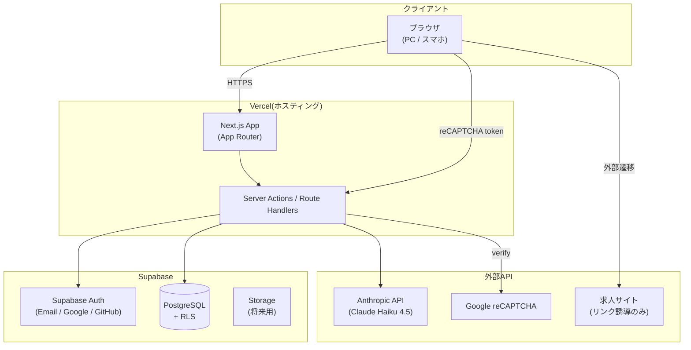
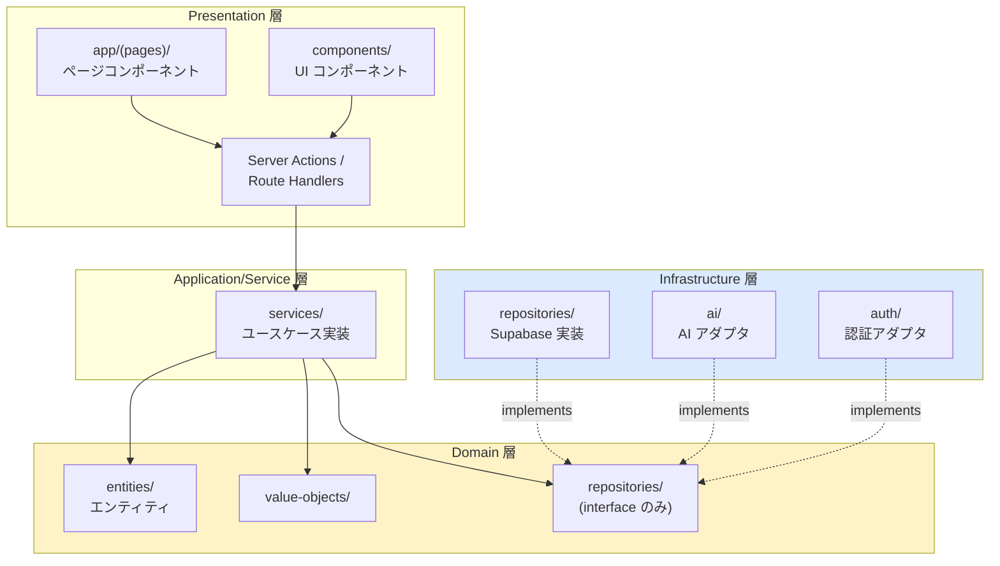
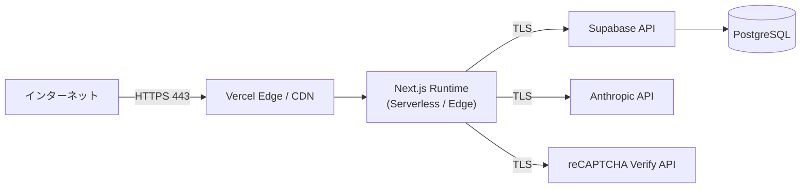
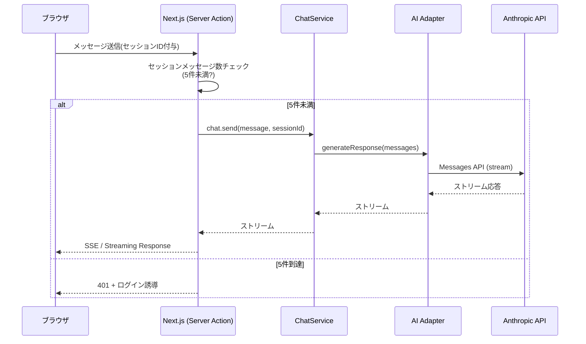
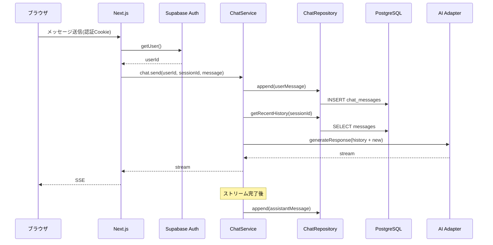
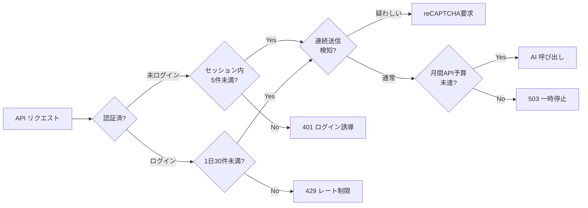

# システム構成図

| 項目 | 内容 |
|---|---|
| プロジェクト名 | engineer-career-ai |
| バージョン | 1.0 |
| 作成日 | 2026-04-26 |

---

## 1. 全体構成

### 1.1 構成図(論理)



### 1.2 構成説明

| コンポーネント | 役割 | 技術スタック |
|---|---|---|
| フロントエンド | UI 描画、ユーザー操作受付、レスポンシブ対応 | Next.js 15 (TypeScript, App Router) + Tailwind CSS |
| バックエンド | API 受付、ビジネスロジック、AI 呼び出し | Next.js Server Actions / Route Handlers (TypeScript) |
| 認証 | ログイン、ソーシャル認証、セッション管理 | Supabase Auth |
| データベース | ユーザー、会話、キャリアプラン等の永続化 | Supabase (PostgreSQL 15) |
| AI | キャリア相談の回答生成 | Anthropic API (Claude Haiku 4.5) |
| ホスティング | デプロイ、CDN、Edge配信 | Vercel |
| Bot対策 | 不正連投検知 | Google reCAPTCHA v3 |

---

## 2. アーキテクチャパターン

### 2.1 採用パターン: レイヤードアーキテクチャ(4層)



**依存方向の鉄則**: `Presentation → Application → Domain ← Infrastructure`
(Infrastructure 層は Domain 層が定義する interface を実装する=依存性逆転)

### 2.2 ディレクトリ構成(計画)

```
project/engineer-career-ai/
├── src/
│   ├── app/                        # [Presentation] Next.js App Router
│   │   ├── (public)/               # 未ログインでもアクセス可
│   │   │   ├── page.tsx            # トップ(壁打ち体験)
│   │   │   ├── login/
│   │   │   ├── signup/
│   │   │   ├── terms/
│   │   │   └── privacy/
│   │   ├── (authed)/               # ログイン必須
│   │   │   ├── chat/               # 壁打ち(本格)
│   │   │   ├── history/            # 履歴
│   │   │   ├── career-plan/        # キャリアプラン
│   │   │   ├── skill-inventory/    # スキル棚卸し
│   │   │   ├── profile/            # プロフィール
│   │   │   └── jobs/               # 求人リンク
│   │   ├── api/                    # Route Handlers (REST API)
│   │   └── layout.tsx
│   ├── components/                 # [Presentation] UI コンポーネント
│   ├── services/                   # [Application] ユースケース
│   │   ├── chat.service.ts
│   │   ├── career-plan.service.ts
│   │   ├── skill-inventory.service.ts
│   │   └── ...
│   ├── domain/                     # [Domain] 純粋 TypeScript
│   │   ├── entities/
│   │   │   ├── user.ts
│   │   │   ├── chat-session.ts
│   │   │   ├── chat-message.ts
│   │   │   ├── career-plan.ts
│   │   │   └── skill-inventory.ts
│   │   ├── value-objects/
│   │   └── repositories/           # interface のみ
│   │       ├── user.repository.ts
│   │       ├── chat.repository.ts
│   │       └── ...
│   └── infrastructure/             # [Infrastructure]
│       ├── supabase/
│       │   ├── client.ts           # Supabase Client(ここでだけ生成)
│       │   └── repositories/       # Repository 実装
│       ├── ai/
│       │   ├── ai.adapter.ts       # interface
│       │   └── claude-haiku.adapter.ts
│       ├── auth/
│       └── recaptcha/
├── docs/                           # 設計書
├── tests/                          # テスト
└── public/                         # 静的アセット
```

### 2.3 設計ルール(厳守)

1. **Supabase Client は `infrastructure/supabase/` 内でのみ import 可**(画面・Service から直接使用禁止)
2. **Server Components 内でも DB アクセスは Service 経由**
3. **Domain 層は外部ライブラリに依存しない**(`@supabase/supabase-js` や `@anthropic-ai/sdk` の型を持ち込まない)
4. **AI モデル呼び出しは AI アダプタ interface 経由**(将来モデル変更時に Service 層を変更しない)
5. **環境変数は `infrastructure/config/` で集約管理**(Service 層から `process.env` を直接参照しない)

---

## 3. ネットワーク構成



### 3.1 セキュリティゾーン

| ゾーン | 該当コンポーネント | 公開範囲 |
|---|---|---|
| Public | Vercel Edge / CDN | インターネット公開 |
| Application | Next.js Serverless / Edge Functions | Vercel 管理(直接アクセス不可) |
| Data | Supabase PostgreSQL | Supabase 管理(RLS で行レベル制御) |
| External | Anthropic / reCAPTCHA | サードパーティ |

### 3.2 通信暗号化

- 全通信 HTTPS(TLS 1.2 以上)
- Vercel・Supabase・Anthropic はマネージドで証明書自動更新
- HSTS 有効化(Next.js のセキュリティヘッダで設定)

---

## 4. データフロー

### 4.1 未ログインで壁打ちするフロー



### 4.2 ログインユーザーの壁打ちフロー(履歴保存)



### 4.3 レート制限とコスト管理



---

## 5. 採用技術と選定理由

| カテゴリ | 採用技術 | 選定理由 |
|---|---|---|
| 言語 | TypeScript 5.x | 型安全、エコシステム豊富、レイヤード設計の interface 表現に適する |
| フレームワーク | Next.js 15(App Router) | フルスタックで Vercel 最適、Server Actions / Streaming SSE が AI チャット UX に最適 |
| UI スタイル | Tailwind CSS | レスポンシブ対応が容易、スマホファースト構築が早い |
| DB | PostgreSQL 15(Supabase) | RLS が認可実装に有効、Supabase Auth との統合が密、無料枠で MAU 5 人想定をカバー |
| 認証 | Supabase Auth | Email / Google / GitHub をプラグインで提供、自前実装より安全・速い |
| AI | Anthropic API(Claude Haiku 4.5) | コスト効率、日本語品質、当開発環境(Claude Code)との親和性 |
| ホスティング | Vercel | Next.js 公式ホスティング、Edge Network、Hobby プランで MAU 5 人想定をカバー |
| Bot 対策 | Google reCAPTCHA v3 | 無料枠が広い、UX 阻害が少ない(スコアベース) |
| ログ・監視 | Vercel Analytics + Supabase Logs | 標準機能で初期は十分。将来 Sentry / Datadog 検討 |
| メール送信 | Supabase Auth 内蔵 + 必要時 Resend | 認証メールは Supabase Auth、通知メール追加時は Resend |

### 5.1 採用しなかった選択肢と理由

| 候補 | 不採用理由 |
|---|---|
| GPT-4o-mini | プロダクトオーナー判断で Claude Haiku 4.5 採用。当開発環境との親和性も評価 |
| 自前認証(Lucia 等) | 個人開発でセキュリティ実装の負担が大きい。Supabase Auth で十分 |
| Cloudflare Workers / Pages | Next.js App Router の Server Actions が Vercel 最適化されているため見送り |
| Firestore | RLS 相当の柔軟性に劣り、リレーショナルクエリも難しい(履歴・キャリアプラン管理に不利) |
| クリーンアーキテクチャ厳密実装 | MAU 5 人想定にはオーバーエンジニアリング。レイヤード採用 |

---

## 6. 環境一覧

| 環境 | 用途 | URL/エンドポイント | 備考 |
|---|---|---|---|
| 開発(local) | 開発者ローカル検証 | `http://localhost:3000` | Supabase ローカル(supabase CLI)or 開発用 Supabase Project |
| ステージング(stg) | 本番同等の検証 | `https://stg.<domain>` (要決定) | Vercel Preview Deploy + Supabase 別 Project |
| 本番(prd) | 利用者向け公開 | `https://<domain>` (要決定) | Vercel Production + Supabase 本番 Project |

### 6.1 環境分離方針

- **Supabase は環境ごとに別 Project**(DB データの混在防止)
- **Anthropic API キーも環境ごとに分離**(本番コストを開発で消費しないため)
- **環境変数は Vercel の Environment Variables 機能で管理**

### 6.2 ドメイン

- ドメイン取得・SSL は MVP リリース直前に決定
- 暫定: Vercel が払い出す `<project>.vercel.app` でステージング相当として運用可

---

## 7. スケーラビリティ方針

| 観点 | 初期(MAU 5) | 拡張時(MAU 数百〜数千) |
|---|---|---|
| Next.js | Vercel Hobby | Vercel Pro へアップグレード |
| Supabase | Free tier | Pro tier(DB サイズ・帯域に応じて) |
| AI API | 月額 $10〜$50 想定 | レート制限 + 月額上限ガードでコスト管理 |
| キャッシュ | 不要 | Vercel KV または Upstash Redis を Infrastructure 層に追加 |
| 監視 | Vercel Analytics + 手動 | Sentry / Datadog |

---

## 8. 関連ドキュメント

| ドキュメント | 役割 |
|---|---|
| `01_requirements/system_requirements.md` | 要件定義(本構成の前提) |
| `02_basic_design/function_list.md` | 機能一覧(本構成の上で実現する機能群) |
| `02_basic_design/security_policy.md` | セキュリティ方針詳細 |
| `02_basic_design/screen_design.md` | 画面設計 |
| `02_basic_design/api_list.md` | API一覧 |
| `02_basic_design/er_diagram.md` | ER図 |
